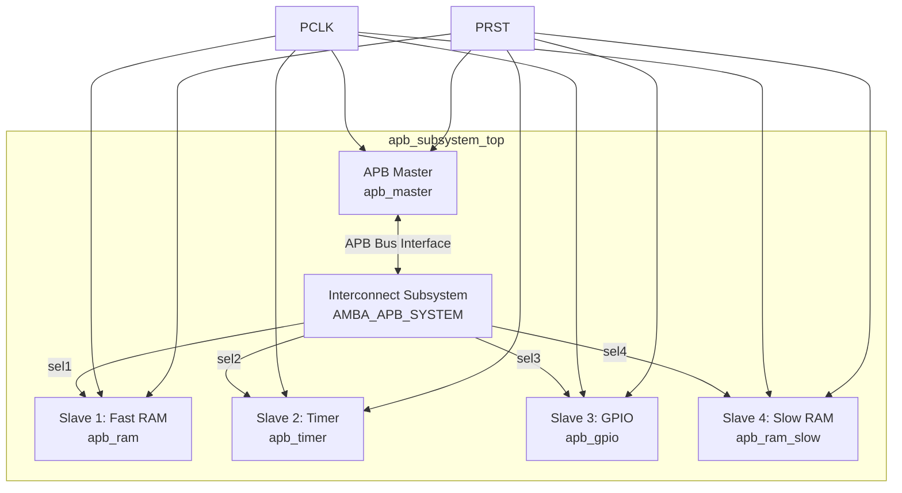
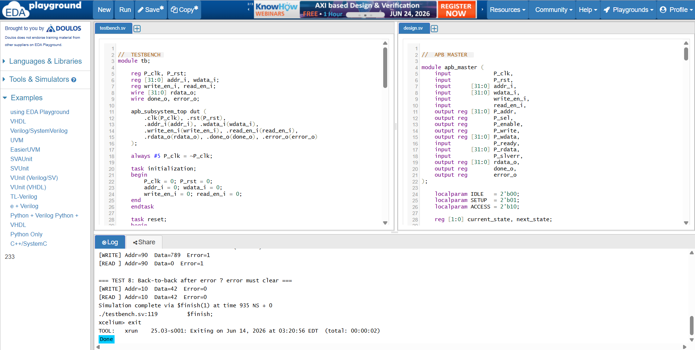
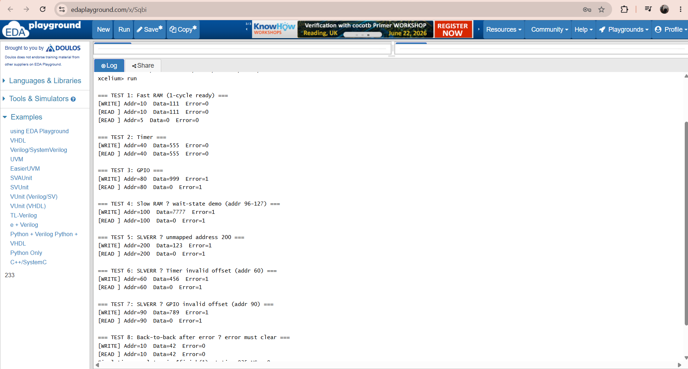

# AMBA APB Protocol Implementation

A modular and verified implementation of the **AMBA 3 APB (Advanced Peripheral Bus)** protocol in Verilog. This project features a unified system comprising an **APB Master** and **four distinct APB Slaves** (Fast RAM, Slow RAM with wait-states, Timer, and GPIO) integrated via an Interconnect/Decoder top-level subsystem.

---

## 📌 Features

- **Modular Master-Slave Architecture**: Decoupled Master FSM and Slave peripheral units with standard APB interfaces.
- **Dynamic Address Decoding**: Seamless interconnect routing transaction signals based on memory-mapped addresses.
- **Clock Stretching (Wait-States)**: Implementation of a Slow RAM unit that holds `PREADY` low for extra cycles to show wait-state handling.
- **Error Detection (`PSLVERR`)**: Robust slave error generation on unmapped accesses or invalid address offsets.
- **Complete Test Suite**: Comprehensive self-checking style logs checking reads, writes, wait-states, and error scenarios.

---

## 📐 Architecture & Block Diagram



### Memory Map

| Slave Unit | Address Range (Decimal) | Features / Behaviors |
|:---|:---|:---|
| **Slave 1: Fast RAM** | `0 - 31` | 1-cycle ready write/read operations |
| **Slave 2: Timer** | `32 - 63` | Control register access; checks offsets <= 8 |
| **Slave 3: GPIO** | `64 - 95` | I/O register access; checks offsets <= 8 |
| **Slave 4: Slow RAM** | `96 - 127` | Clock stretching; inserts 2 wait-states |
| **Unmapped Region** | `>= 128` | Triggers immediate `PSLVERR` |

---

## 🚦 APB Master State Machine

The master FSM controls the protocol transitions using the following states:

1. **IDLE**: Default state. The bus is inactive (`PSEL = 0`, `PENABLE = 0`). Transitions to **SETUP** on read/write requests.
2. **SETUP**: Master asserts the slave select signal `PSEL` and drives `PADDR`, `PWRITE`, and `PWDATA`.
3. **ACCESS**: Master asserts `PENABLE`. If `PREADY` is asserted by the selected slave, the transaction completes and the FSM returns to **IDLE** (or **SETUP** if a new transaction is pending). If `PREADY` is low, the FSM remains in **ACCESS** (wait-states).

---

## 💻 Modules List

### 1. APB Master (`apb_master`)
- Orchestrates setup and access phases.
- Captures read data (`PRDATA`) and error status (`PSLVERR`) upon successful transaction completion (`PREADY = 1`).

### 2. Fast RAM (`apb_ram`)
- Internal memory: 32 words of 32-bit width.
- Responds instantly by asserting `PREADY` in the first access cycle.
- Raises `PSLVERR` if address is out of bounds (`> 31`).

### 3. Slow RAM (`apb_ram_slow`)
- Mimics a slower memory resource.
- Asserts `PREADY` only after 2 additional wait cycles (3 ACCESS cycles total).

### 4. Timer (`apb_timer`)
- Simple timer configuration register.
- Generates `PSLVERR` if accessed with register offset greater than 8.

### 5. GPIO (`apb_gpio`)
- Generic input/output register block.
- Generates `PSLVERR` if register offset exceeds 8.

### 6. Top Subsystem Wrapper (`apb_subsystem_top`)
- Connects the APB Master and the decoded multi-slave system together.

---

## 🧪 Simulation & Verification

The testbench (`apb_final_testbench.v`) validates the design under the following scenarios:

- **Test 1**: Write & Read from Fast RAM (Verify zero wait-state throughput).
- **Test 2**: Write & Read from Timer peripheral registers.
- **Test 3**: Write & Read from GPIO peripheral registers.
- **Test 4**: Wait-state demonstration using Slow RAM (Observe `PREADY` delay).
- **Test 5**: Error generation (`PSLVERR`) on accessing an unmapped address (e.g. `200`).
- **Test 6**: Out-of-bounds offset error generation on the Timer module.
- **Test 7**: Out-of-bounds offset error generation on the GPIO module.
- **Test 8**: Verification of back-to-back operations (Verify error status clears correctly).

### Expected Simulation Logs:

```text
=== TEST 1: Fast RAM (1-cycle ready) ===
[WRITE] Addr=10  Data=111  Error=0
[READ ] Addr=10  Data=111  Error=0
[READ ] Addr=5  Data=0  Error=0

=== TEST 2: Timer ===
[WRITE] Addr=40  Data=555  Error=0
[READ ] Addr=40  Data=555  Error=0

=== TEST 3: GPIO ===
[WRITE] Addr=80  Data=999  Error=0
[READ ] Addr=80  Data=999  Error=0

=== TEST 4: Slow RAM – wait-state demo (addr 96-127) ===
[WRITE] Addr=100  Data=7777  Error=0
[READ ] Addr=100  Data=7777  Error=0

=== TEST 5: SLVERR – unmapped address 200 ===
[WRITE] Addr=200  Data=123  Error=1
[READ ] Addr=200  Data=0  Error=1

=== TEST 6: SLVERR – Timer invalid offset (addr 60) ===
[WRITE] Addr=60  Data=456  Error=1
[READ ] Addr=60  Data=0  Error=1

=== TEST 7: SLVERR – GPIO invalid offset (addr 90) ===
[WRITE] Addr=90  Data=789  Error=1
[READ ] Addr=90  Data=0  Error=1

=== TEST 8: Back-to-back after error – error must clear ===
[WRITE] Addr=10  Data=42  Error=0
[READ ] Addr=10  Data=42  Error=0
```

---

## 📈 Visual Waveform & Results

### APB Waveform Overview
Below is the timing diagram capturing the states and signal transitions of the APB master-slave interaction:


### EDA Playground Simulation Setup
Simulation snapshot on EDA Playground:



### Testbench Output Log
Standard terminal output validation:



---

## 🚀 How to Run locally

You can compile and run this using any standard Verilog simulator (e.g. **Icarus Verilog**):

1. **Compile**:
   ```bash
   iverilog -o apb_sim apb_design_final.v apb_final_testbench.v
   ```

2. **Run**:
   ```bash
   vvp apb_sim
   ```

3. **View Waveform (Optional)**:
   ```bash
   gtkwave dump.vcd
   ```
